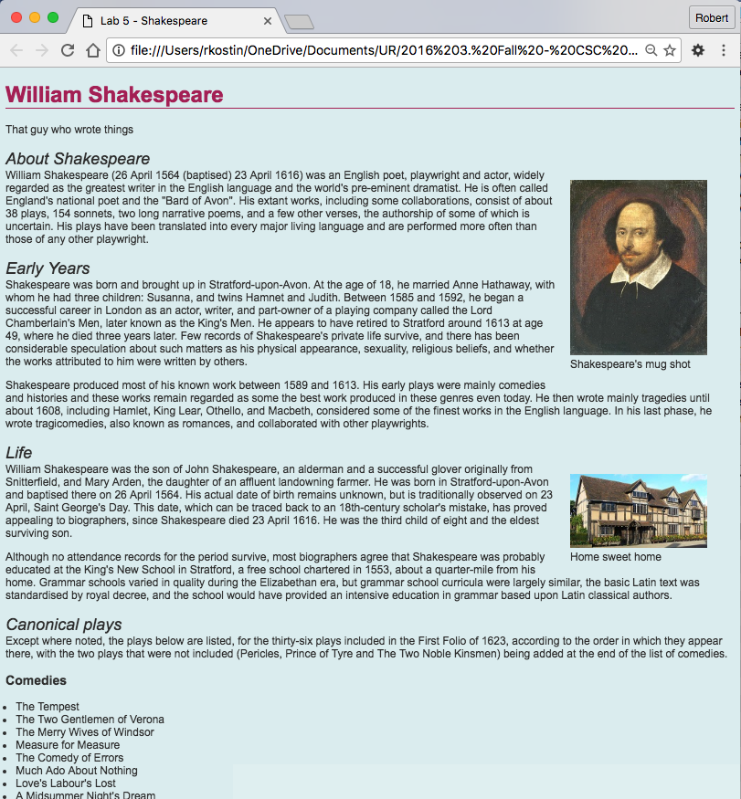

Step 1: Make a copy of Lab 4
============================

>   After you’ve completed Lab 4 and got a good grade on it, make a copy of all
>   the files in it to a new folder named lab05

-   In your new lab05 folder, create another new folder named css

Step 2: Link a CSS file
=======================

-   In your **css** folder, in the same way you originally created your original
    HTML file (a *plain text* file), create a new plain text file and name it:
    **styles.css** [^1]

    [^1]: Make sure your new **styles.css** file is in the new **css** folder

-   Edit the Lab 5 HTML document (**start.html**). In the \<head\> of that
    document, create a \<link\> to the CSS file that you created in the **css**
    folder.[^2]

    [^2]: How to write a \<link\> tag was covered in the last lecture.

    -   Typically, the \<link\> tag goes under the \<meta\> and \<title\> tags,
        but technically, it’ll work anywhere.

Step 3: Write some CSS – test the connection
============================================

-   Open the file: **styles.css** in your code editor and write some simple CSS
    to test the link between your HTML document and your CSS file:

1.  In your CSS file add some simple code like this:  
    body { color: red; }

2.  Save your CSS file.

3.  Toggle over to your web browser (which should have your HTML file loaded in
    it), and refresh the browser.

4.  If the text in your web page turned red, then you’re good to go! If not, you
    need to figure out what went wrong before proceeding.

When you’re done with this step, you can delete the body { color: red; } code
from your CSS file and re-save it as an empty file before proceeding.

Step 4: Add styles to your HTML document using CSS
==================================================

For the rest of this section, you will write CSS code into your CSS document[^3]

[^3]: Google: “CSS \____” …where the blank is whatever property you need to
learn, e.g. “CSS background color”

Remember the syntax for CSS:

-   The selector (like “body”) followed by open and closed curly braces (“{“ and
    “}”)

-   Inside the curly braces are the declarations

-   Each declaration property ends with a colon (“: “)

-   Each declaration value ends with a semi-colon (“; “)

*Start writing CSS!*

-   As you write CSS code, use lots of *white space*! Make sure you indent and
    space your CSS selectors and declarations appropriately to make it easy to
    read the code.

-   Give the entire web page a set of default styles: (Hint: for these styles,
    use the body {} selector in your CSS file to set defaults that will
    “cascade” throughout the webpage)

    -   **Background color** of \#DFEFF0  
        (that last character is a zero, not an “o”)

    -   Text **color** of \#333333

    -   **Font family** of: Arial, Helvetica, sans-serif

-   All first level headings should be styled like this:

    -   Text **color** of \#AD235E

    -   Add a border underneath each first level heading so it has a **solid
        bottom border** that’s one **1px** and **color**ed: \#AD235E;

-   All second level headings should be styled like this:

    -   A **font style** of italic

    -   A **font weight** of normal (i.e., not bold)

    -   No **margin** (i.e. 0px) along their **bottom** side

-   All paragraphs should have no **margin** (i.e. 0px) along their **top**
    side)

-   Set all the **figure** elements in your document so they “**float**” to the
    **right**

-   Also set the **figure** elements so they have **20px** of **margin** on
    their **left**

-   Set the **padding** on any lists you use (**ol** and/or **ul**) so they have
    **15px** on their **left**

-   Change the way your hyperlinks (“a” tags) are displayed. Set their color to:
    \#7D9C9F

-   Also remove the underline (the text “**decoration**”) from all hyperlinks
    (set them to “**none**”)

-   And finally, there’s a way to get the “hover” of your anchor tags to change
    too, so when you hover your mouse over a link, it can do something.

    -   Add this selector to your CSS: a:hover { color: \#AD235E; }

Step 5: Upload your work
========================

When you are done with your webpage, close everything and use an FTP tool (like
*WinSCP* or *Cyberduck*) to access your account on **cs.rochester.edu/csc170**
(remember your FTP login information?) and upload your files like this:

1.  Open an FTP tool and login to your account using the login credentials you
    used in Lab 1.

2.  Drag your **lab05** folder into the file area in your FTP tool. The result
    will put all your files and folders on the server in a folder named
    **lab05**.

-   In a web browser (any), go to this address to check your handiwork:  
    **www.urcsc170.org/accountname/lab05/start.html**  
    (where “*accountname*” is your account name)

Remember: All files and folder names must always be all lowercase and no spaces.

Step 6: Report your work
========================

Remember: Use the W3C HTML validator (**validator.w3.org**) AND the W3C CSS
validator (**http://jigsaw.w3.org/css-validator**) to check your work before you
report it!

-   In our Blackboard section, in Lab 05, post a link to your webpage to receive
    credit for this Lab.

Example of Lab 5
================

