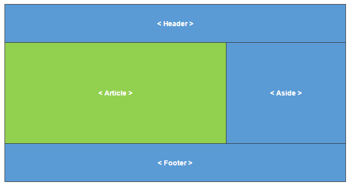
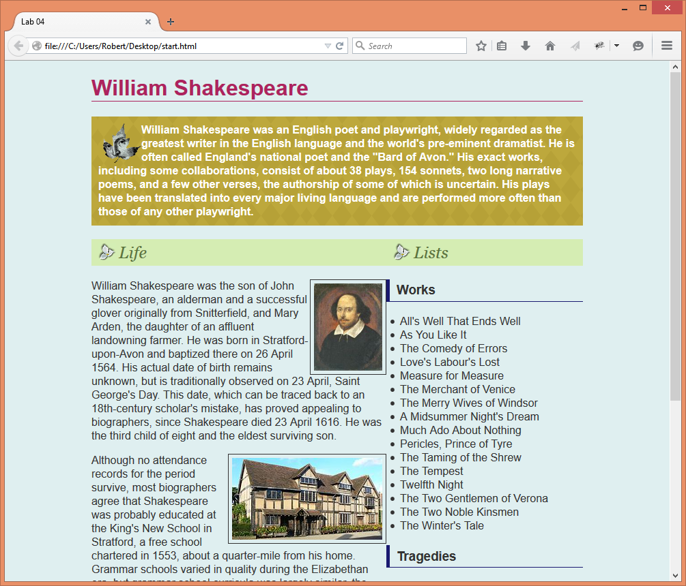

Step 1: Make a copy of Lab 6
============================

-   *After* you’ve completed Lab 6 and got an acceptable grade, make a copy of
    all the files in it to a new folder named **lab07**

-   Change the TITLE in the HTML to reflect the change to “Lab 7…”

Step 2: Add a layout technique to your webpage
==============================================

-   Your document must use a “container” as demonstrated in a recent lecture.
    You don’t have to constrain *all* your content (although that’s okay if you
    do), but you must demonstrate good use of the trick…

-   In HTML…  
    \<body\>  
    \
  
      
    \</div\>\<!--.container--\>  
    \</body\>

-   In CSS, create a class named ".container" and apply the appropriate styles
    to make the content "float" so to speak, in the center of the viewport.

Using the CSS **Grid** layout technique, position your HEADER, ARTICLE, ASIDE,
and FOOTER elements into a classic "c-clamp" layout.

-   All four structural elements in your webpage must be positioned using GRID
    properties.

-   Do not alter your original HTML document.

    -   However, depending on how you setup your content originally in your
        ARTICLE and ASIDE you may need to move some content around to balance
        the page layout.[^1]

        [^1]: Normally you would never do that, but for these lab assignments
        it's okay - just for demonstration purposes.

-   When you position the content, chances are you’ll need to adjust the box
    model of the elements that are side-by-side to keep the content readable and
    generally usable. For example, if the ARTICLE and ASIDE elements were full
    of text, and then you lay them out side-by-side, the content smashes against
    the sides like this:  
    

    

    Alter the box model of the elements (in this case, that’ll be the ARTICLE
    and/or ASIDE) by adding margin and/or padding to them as demonstrated in the
    last lecture, OR by using the appropriate GRID property to apply a "gutter."

Step 3: Upload your work
========================

When you are done with your webpage, close everything and use an FTP tool (like
*WinSCP*) to access your account on **urcsc170.org** and upload your files:

-   In a web browser (any), go to this address to check your handiwork:  
    **www.urcsc170.org/accountname/lab07/start.html**  
    (where “*accountname*” is your account name)

Report your work
================

Remember: Use the W3C HTML validator (**validator.w3.org**) AND the W3C CSS
validator (**http://jigsaw.w3.org/css-validator**) to check your work before you
report it!

-   In our Blackboard section, in Lab 7, post a link to your webpage to receive
    credit for this Lab.
