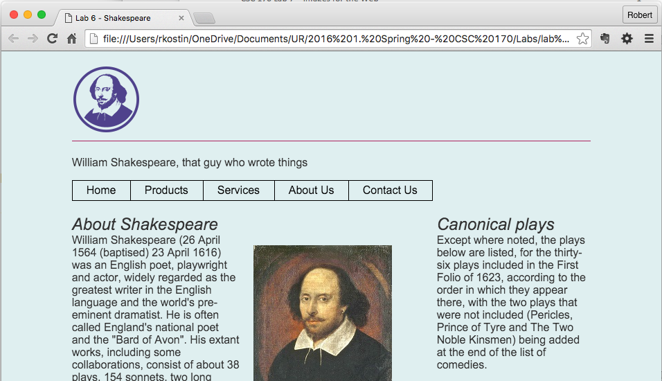
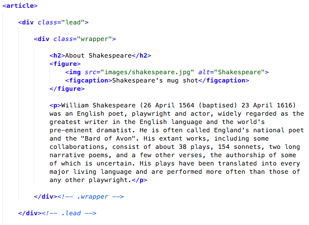
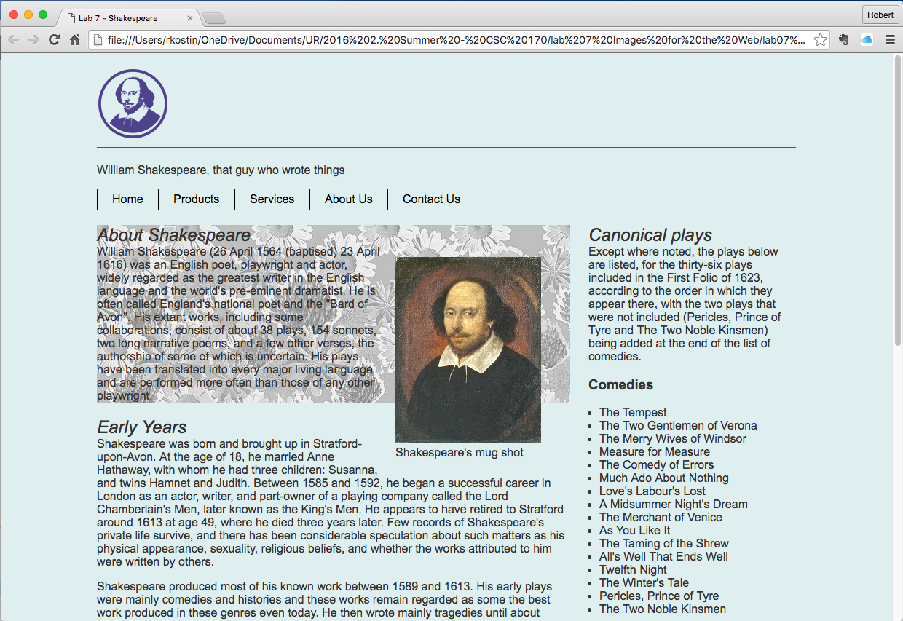
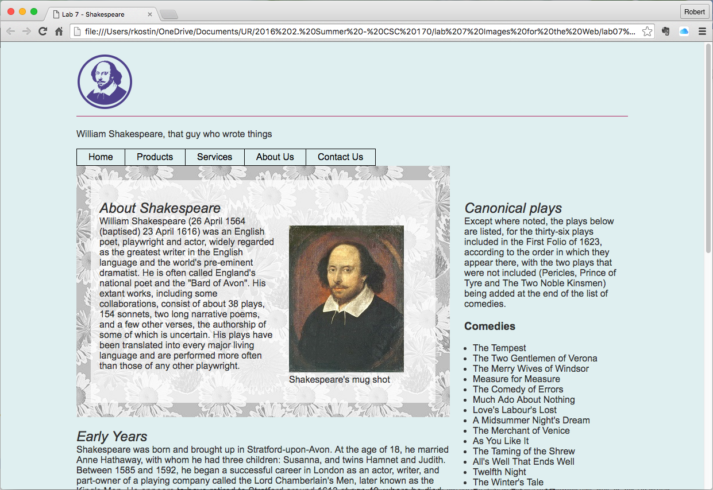

In this lab you will prepare and install images on a web page.

Make a copy of Lab 8 
=====================

-   *After* you’ve completed Lab 8 make a copy of all the files in it to a new
    folder named **lab09**

-   In your **start.html** file, Change the title in the \<title\> tag to "Lab 9
    - …"  
    e.g. \<title\>**Lab 9** - Shakespeare\</title\>

Image prep
==========

-   Find a new image to act as the logo (not necessarily really a logo) for your
    webpage.

    -   It should be related to the topic you picked.

    -   It should be no wider than about 100px and no higher than about
        100px[^1]

        [^1]: In Google Images, after you do a search for your subject matter,
        click the SEARCH TOOLS button, then click SIZE and select EXACTLY…

    -   Place the image in your **images** folder

-   Find a suitable image that you can use as a background

    -   It should be suitable for use as a background; keep in mind it may be
        distorted when you use it, so clouds, grass …stuff like that might be a
        good candidate

    -   You can tweak the image using whatever software you have available;
        perhaps lower the contrast, remove the saturation, whatever

    -   The image should be no wider than about 400px

    -   Place the image in your **images** folder

Here are examples from Google Images of what might constitute good images to use
in this lab assignment if your topic was Shakespeare:

| [./media/image1.png](./media/image1.png) | [./media/image2.tiff](./media/image2.tiff) flower_bg.jpg 400x400px |
|------------------------------------------|--------------------------------------------------------------------|

~   /Users/rkostin/Desktop/logo.png

logo.png

100x100px

NOTE: this lab uses the **start.html** file that was left over from Lab 8. (The
file that *was not* included in your menu system.) For this lab, you'll be
editing the **start.html** and **styles.css** files only. (Leave the other HTML
files and the navigation.css file alone.)

Insert the logo in HTML
=======================

-   In your **start.html** file, inside the H1 add an anchor tag (along with the
    text that's already there) and set the href to “\#”

-   *Replace* the text inside the H1 with an IMG tag that points to your logo
    image

-   In the DIV for the subtitle under your H1, add the text that used to be in
    your H1 to your subtitle

    -   E.g. If your H1 said “William Shakespeare” and your subtitle said “That
        guy who wrote things,” you’ll change it to: “William Shakespeare, that
        guy who wrote things”

Here is an example of what your webpage might look like:

Prep an area for a background image
===================================

-   In the HTML, within your ARTICLE element, wrap the first H2, the figure
    element and the first paragraph in a DIV element and add a class to it named
    “**lead**” (or something else if you already used "lead" for something else.

-   Then inside the new DIV with the **.lead** class, again wrap the first H2,
    the figure element and the first paragraph in another DIV element and add a
    class to it named “**wrapper**”

    -   After you add the new DIVs use proper white space (indentation) on the
        inner HTML elements

Here’s what your code might look like…

-   In the CSS, add a new class named **.lead** (or whatever you used) and use
    the background-image property to set the background image to whatever you
    picked out[^2]

    [^2]: Common difficulties (“gotchas”) using the **background-image**
    property include…  
    - You have to use the **url()** value to point to the background image
    (Google: “css background image”)

        >   \- Remember how to link to a sibling folder in the **url()** using
        >   “**../images/**” to navigate *up* to the parent folder then back
        >   down to the sibling folder

Here’s what your webpage might look like at this point…  

Fix the Readability of the Webpage
==================================

Just by adding the background to the “lead” section of the website you’ve
created a lot of usability/readability problems. You have to fix them.

-   In the CSS, add some padding inside the **.lead** style to move the text
    away from the edges.[^3]

    [^3]: In my example, I added 25px on all sides of the **.lead**

Depending on the background image you used, the text will become unreadable. One
way to fix that is to add another background behind your content. A nice effect
you can try is to add a background color with transparency.

-   In the CSS, using the RGBA color system, apply background-color to the DIV
    with the **.wrapper** class and use some transparency

    -   Suggestion: for the background-color, try this value[^4],[^5]  
        rgba(255, 255, 255, 0.7)

        [^4]: On the background-color property, you use that value *instead* of
        a color keyword (like “blue” or “red”) or instead of a hex value (like
        \#ff0000 or \#ab3304)

        [^5]: The 0.7 in that example controls the amount of transparency being
        used. Try any value between 0.0 and 1.0. Pick a value that allows the
        background image to be visible a lot without compromising the
        readability of the text*.*

-   In the CSS, add *more* padding – this time inside the **.wrapper** style to
    move the text away from the edge of the inner background.

Depending on the dimensions of your image (insider your FIGURE element) you may
have to “fix” the float problem.

-   Add the overflow: auto; property to the **.wrapper**. That should fix it.

Here’s what your webpage might look like at this point…  

*As always, still not winning any awards for design, but it’s readable!*

Upload your work
================

When you are done with your webpage, close everything and use an FTP tool to
access your account on **urcsc170.org** and upload your files:

-   In a web browser (any), go to this address to check your handiwork:  
    **www.urcsc170.org/accountname/lab08/start.html**  
    (where “*accountname*” is your account name)

Report your work
================

Remember: Use the W3C HTML validator (**validator.w3.org**) AND the W3C CSS
validator (**http://jigsaw.w3.org/css-validator**) to check your work before you
report it!

-   In our Blackboard section, in Lab 8, post a link to your webpage to receive
    credit for this Lab.
