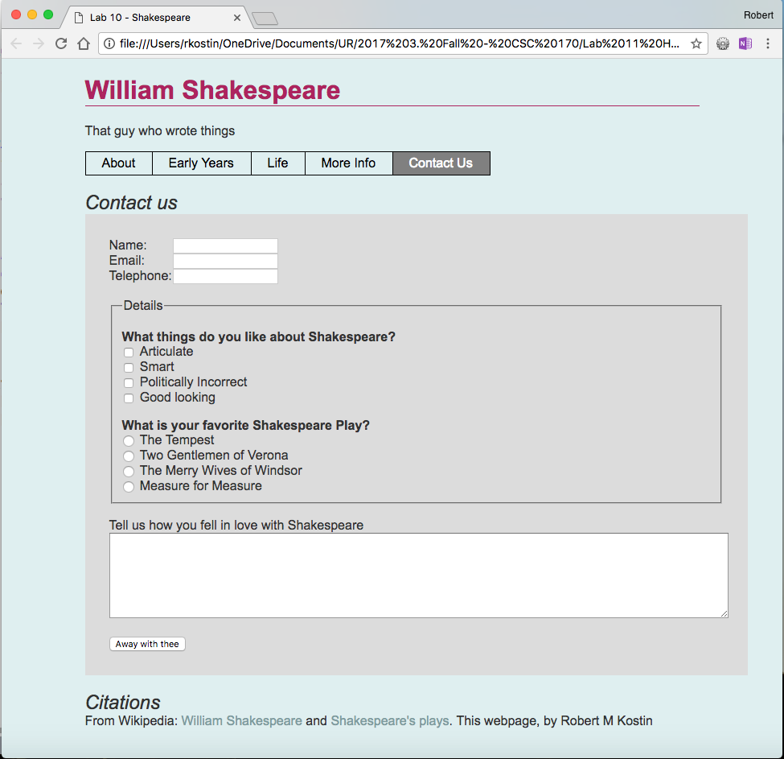

For this lab, you will create a valid HTML form and insert it into your website.
Use the comp provided (last page of this document) as a guide to create your own
version of the form and follow the instructions below.

NOTE: Usually you make a copy of the last lab as a starting point for the
current lab. This time you may choose whether you start with Lab 9 (PHP
Includes), or if you don't want to deal with PHP Includes anymore you may revert
to Lab 8 and make a copy of that instead.

Part 1: Add a New Webpage to Your Website
=========================================

-   Make a copy of your Lab 8 or Lab 9 folder and name the new folder named
    **lab10**

-   Open all the HTML files in your code editor and make the following changes
    to **all of them**:[^1]

    [^1]: Or if you're still using PHP includes (Lab 9), you simply have to
    update two **.inc** files

-   Change the titles in the \<title\> tags to "Lab 10 - …"  
    e.g. \<title\>**Lab 10** - Shakespeare\</title\>

-   Add a new menu item to the navigation on each page like this:  
    \<li\>\<a href="contact.html"\>Contact Us\</a\>\</li\>

-   Make a copy of any one of your HTML files; call the new file: **contact.html
    (or contact.php)**

-   Edit the **contact.html** ( or .php) file

-   *If you're using the non-PHP version of your website (from Lab 8) only…*  
    In the NAV element, add the class, **class="is-current"** to the Contact Us
    anchor tag[^2]

    [^2]: If you based this lab after Lab 9, then your "is current" menu
    highlighter will continue to be broken until we fix it later in the
    semester.

-   In your **contact** file, remove the content *within* the ARTICLE element.
    (Leave the ARTICLE tag there.)

-   In your **contact** file, remove the ASIDE element in its entirety.

-   In your **contact** file, add the ID "contact" on the BODY tag like this:  
    \<body **id="contact"**\>

-   In your **styles.css** file, target the ARTICLE on your contact webpage with
    a new style and tell it to span the CSS Grid, from lines 1 to 3, like this:  
    \#contact article { grid-column: 1 / 3; }

-   Within the ARTICLE, create a new H2 like this:[^3]  
    \<h2\>**Contact Us**\</h2\>

    [^3]: It doesn’t have to say, “Contact Us.” You can be creative here.

Part 2: Create the HTML Form
============================

Refer to the comp at the end of this document as a guide, and then code the
following form controls required for this assignment.

-   Under the H2, create a \<form\> element. The \<form\> element must have two
    attributes:

    -   A **method** that has a value of **"post"**

    -   An **action** that has a value of **"\#"**

General Requirements 
---------------------

You must create a web form that uses the following elements:

-   A set of **text input** fields (at least three) that use the attribute,
    type="**text**"  
    (or you can swap “text” for “email” or “url” or “tel” …whatever’s
    appropriate, so long as there’s at least three of them.)

-   A set of **checkboxes**  
    At least three; they can be about whatever you want so long as they have
    something to do with your lab’s content.

-   A set of **radio buttons**  
    At least three; they can be about whatever you want so long as they have
    something to do with your lab’s content.

-   A **fieldset** and **legend** around your checkboxes and radio buttons.

-   A **textarea** field

-   A **submit** button with *custom words* on the button

Also, make sure you follow these requirements as you build your HTML form:

-   Each form element that captures data (e.g. INPUT or TEXTAREA) you must
    include the following attributes in each:[^4]

    [^4]: You do *not* have to use a **name=””** attribute nor an **id=””**
    attribute for the SUBMIT button.

    -   a **name** attribute

    -   an **id** attribute

>   Remember: when writing values for **name=""** and **id=""** web developers
>   typically use the same value, e.g. name="*email*" and id="*email*" …but
>   *not* for radio buttons!  
>     
>   For radio buttons, all the name="" attributes must be the same. But id=""
>   attributes must be unique.

-   As you create EACH form element that captures data (e.g. INPUT or TEXTAREA),
    you must create a label that uses the appropriate HTML element
    (**\<label\>**) and attribute (**for=""**) to associate it with the form
    element it's labeling.[^5]

    [^5]: In the example at the end of this document, the text, "What things do
    you like…" and "What is your favorite…" are \*not\* labels! They’re
    headings. (They’re H3s.)

The Checkbox and Radio Button Controls
--------------------------------------

-   For each checkbox, include the attribute: **value=""** into which you can
    write some text that indicates what the checkbox represents

-   For each radio button, include the attribute: **value=""** into which you
    can write some text that indicates what the radio button represents

The Rest of the Form Controls
-----------------------------

-   Create a text area as shown in the comp to capture the user's comments.

-   Create a submit button using the **value=""** attribute so it says something
    besides the default.

Part 3: Style the Form
======================

-   In the HEAD of the contact.html file (or in your html-top.inc file) add a
    new LINK to another CSS file like this:  
    \<link rel="stylesheet" href="css/form.css"\>

-   In the **css** folder, create a new plain text file named **form.css**

-   Next, you’re provided with some simple CSS for your **form.css** file that
    should work automatically to provide some basic styles to your HTML files.

-   It is not required but you are encouraged to embellish the styles here – try
    your own variations to make it look nicer.

CSS you can steal use (with my permission):

**form {**

background-color: rgba(255,255,255,0.7);

padding: 30px;

width: 100%;

**}**

/\* assuming you’re using H3s, you can do something like this...\*/

**form h3 {**

margin-bottom: 0;

font-size: 16px;

**}**

/\* To make the following style work, in your HTML you need to add class="fixed"
to the \<label\> elements that label the type="text" elements...\*/

**form label.fixed {**

display: inline-block;

width: 75px; /\*...adjust as needed \*/

**}**

**form textarea {**

width: 100%;

height: 300px;

**}**

…but try to do better than this! Design the form so it works with your website's
design.

Comp
====

Use this as a guide for your Contact page. However, your styles should be
appropriate for *your* website.

Part 4: Upload and Report your Work
===================================

When you are done with your webpage, use an FTP tool to access your account on
**urcsc170.org** and upload your files.

-   In a web browser, go to this address to check your handiwork:  
    **www.urcsc170.org/accountname/lab10/contact.html**  
    (where “*accountname*” is your account name)

-   Remember: Use the W3C HTML validator (**validator.w3.org**) to check your
    work before you report it!

-   In our Blackboard section, in Lab 10, post a link to your webpage to receive
    credit for this Lab.
