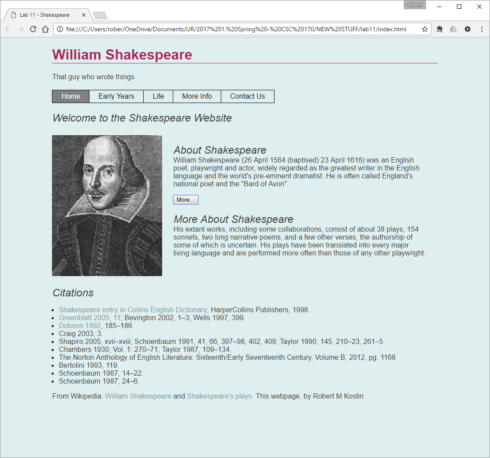

For this lab, you will do much the same as what you did in Lab 12 except this
time you’ll use your own content from Lab 11, and insert some simple JavaScript
behaviors using your own content.

Make a copy of your Lab 11 folder
=================================

-   Make a copy of your **lab11** folder and name the new folder named **lab13**

Get two new small, identically-sized images
===========================================

-   Prepare two new images

    -   The two new images must be related to your website’s topic

    -   The two new images must have the same, identical height and width
        dimensions

    -   The two new images must have a width dimension of no more than say about
        300px

    -   The two new images must have filenames that comport to the rules for
        naming web files (all lower case, no spaces).

-   Preparing identically-sized images might take some extra work using software
    on your PC or Mac.

    -   On a PC, the application “Paint” comes with Windows and will work well
        enough

    -   On a Mac, the application “Preview” has “tools” that will work well
        enough

-   Put the two new images in your lab13/**images** folder.

Add a Homepage to Your Website
==============================

Make the following changes to your website. The way you do it will vary
depending on whether you're using regular HTML pages, or you're using PHP
Includes.

-   Rename your **start.html** file to **index.html** (or **.php** as
    appropriate)

-   Change the titles in the \<title\> tags to "Lab 13 - …"

-   Add a new menu item to the navigation on each page like this:  
    \<li\>\<a href="**index.html**"\>**Home**\</a\>\</li\>

**IF you are using regular HTML pages (not PHP includes)** do the following:

-   In the NAV element, add the class, **class="is-current"** to the Home anchor
    tag (or whatever you used on the other pages) like this:  
    \<li\>\<a **class="is-current"** href="index.html"\>Home\</a\>\</li\>

**IF you are using PHP includes**: the current page highlighter will continue to
*not* work. (That's okay.)

**IF you are using regular HTML pages (not PHP includes)** do the following:

-   In the HEAD of the **index.html** file, add a LINK to a new CSS file named
    **hero.css** (to be created later): \<link rel="stylesheet"
    href="**css/hero.css**"\>

**IF you are using PHP includes**:

-   In the HEAD of the **top-part.inc** file, add a LINK to a new CSS file named
    **hero.css** (to be created later): \<link rel="stylesheet"
    href="**css/hero.css**"\>

Build the new Homepage to Your Website
======================================

-   In your **index** file (.html or .php), above the content (ARTICLE and
    ASIDE) and below the NAV **add a SECTION element**

-   Add an H2 in the SECTION element - some kind of welcome message, something
    like this:[^1]  
    \<h2\>**Welcome to The World of William Shakespeare**\</h2\>

    [^1]: It doesn’t have to say, “Welcome to….” You can be creative here.

-   Add a class to the SECTION tag, class="hero" like this…  
    \<section class="hero"\>  
      
    \</section\>\<!--.hero--\>

-   Within the SECTION element, add a FIGURE element and a DIV ike this…  
    \<section class="hero"\>  
    \<h2\>Welcome to The World of William Shakespeare\</h2\>  
    **\<figure\>**  
    

    **\</figure**

    **\<div\>**  
    

    **\</div\>**  
    \</section\>\<!--.hero--\>

Create and Style a new hero.css file
====================================

-   In the **css** folder, create a new plain text file named **hero.css**

-   In this step, you’re provided with some simple CSS for your **hero.css**
    file that should work automatically to provide some basic styles to your
    index page.

-   It is not required but you are encouraged to embellish the styles here – try
    your own variations to make it look nicer.

CSS you can use:

**.hero {**

display: **grid;**

grid-template-columns: **1fr 2fr;**

border-bottom: **1px solid \#333333;**

**}**

**.hero h2 {** grid-column: **1 / 3; }**  

Add a Swappable Image
=====================

-   Within the new FIGURE add an IMG tag to embed one of the new images  
    Something like this:  
      
    \<figure\>  
    \  
    \<figcaption\>Some words - you write here\</figcaption\>  
    \</figure\>  
    …In the blanks (above) use whatever you named one of your new images in the
    SRC and write its description in the ALT

-   Add the JavaScript **onmouseover** event to the image element to change the
    source (the “src”) to the other new image when a mouse hovers over that
    element

-   Add another JavaScript **onmouseout** event to the *same image element* to
    change the source (the “src”) to back to the original image when the mouse
    moves *out* from hovering over that element

Add Some Hidden Content
=======================

-   Insert two DIV elements within the second DIV after the FIGURE element  
    like this:  
    \<div\>  
    \<div\>  
    \</div\>  
    \<div\>  
    \</div\>  
    \</div\>

-   Add a button element that says “More…” between the two DIVs  
    like this:  
    \<div\>  
    \<div\>  
    \</div\>  
      
    \<button\>More...\</button\>  
      
    \<div\>  
    \</div\>  
    \</div\>

-   “Steal” some content from your ARTICLE and/or ASIDE[^2]

    [^2]: A good candidate is an “Introduction” or an “About” page if you have
    one. You need at least two paragraphs.

-   Insert the two paragraphs (and their headers preferably) into the two DIVs
    (respectively) Something like this (using your content, not Shakespeare):  
    \
  
    \<div\>  
    \<h2\>About Shakespeare\</h2\>  
    \<p\>William Shakespeare was an English poet...p\>  
    \</div\>  
    \<button\>More...\</button\>  
    \<div\>  
    \<h2\>More About Shakespeare\</h2\>  
    \<p\>His extant works, including...\</p\>  
    \</div\>  
    \</div\>

-   Delete the rest of the content on the page - the ARTICLE and the ASIDE

From an appearance standpoint, you should have something that looks like this…  

Power the Button
----------------

-   Add an ID to the BUTTON element (something to indicate what it’s supposed to
    do, e.g. “toggler” or “disappearer”)

-   Add an ID to the *second* DIV element (something to indicate what it’s
    supposed to do, e.g. “togglee” or “peek-a-boo”)

-   In the file system, add a new folder named: **js**

-   Make a copy of the JavaScript file from Lab 12 (js/**scripts.js**) and copy
    it to your new **js** folder in **lab13**

-   Near the bottom of the **Index** page, just above the closing BODY tag, add
    an embedded JavaScript block using the \<script\> tag, connect the external
    JavaScript file named: **js/scripts.js**

-   As necessary, edit the **scripts.js** file to work with **lab13**

    1.  Change the name of the *toggler* to whatever you used in your HTML
        document

    2.  Change the name of the *togglee* to whatever you used in your HTML
        document

-   Change the default display setting from “inline” to “none” like this:  
    toggle_element.style.display = 'none';

Check and Upload your Work
==========================

-   If your index.html file works correctly:

    -   When you first load the webpage the second paragraph is NOT showing

    -   When you hover your mouse over the image it changes

    -   When you move your mouse away from the image, it changes back

    -   When you click the “More…” button, the hidden paragraph appears

    -   When you click the “More…”button again, the paragraph disappears again

-   Validate the HTML file (**http://validator.w3.org/**)

When you are done with your webpage, close everything and use an FTP tool (like
*WinSCP*) to access your account on **urcsc170.org** and upload your files:

-   In a web browser (any), go to this address to check your handiwork:  
    **www.urcsc170.org/accountname/lab13/index.html**  
    (where “*accountname*” is your account name)

Report your work
================

-   In our CSC 170 Blackboard section in the Lab 13 assignment, post a link to
    your webpage to receive credit for this Lab.
